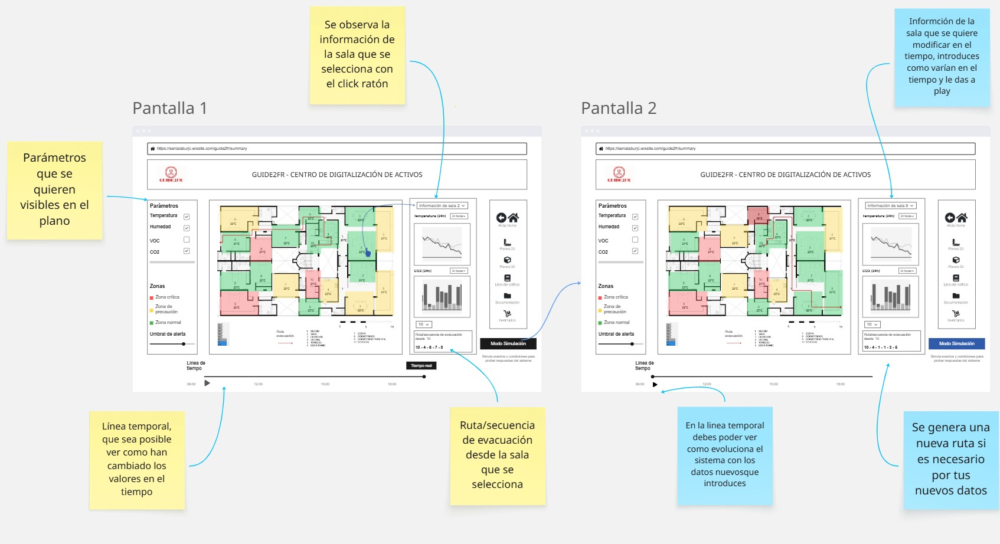

# Boceto de wireframe: Recomendación de rutas

## Contexto y objetivo

El objetivo de este wireframe es tener una estructura de la pagina, la arquitectura de la información y la funcionalidad de la aplicación, basicamente para lo que sirve un wireframe en general.

El objetivo no deja de ser la recomendación de rutas de evacuación, pero además se puede en una primera vista visualizar en estado actual de la planta del edificio en cuestión.

Adicionalmente he incluido un apartado de simulación que abre la posibilidad de introducir los datos manualmente para ver como responde el sistema.

El proposito es tener un apoyo visual de como se deberia de ver la aplicación de esta función en la pagina ya existente de la que me he basado.

https://senialaburjc.wixsite.com/guide2fr/summary.

Como he dicho me he basado en la estructura que se ve en el video subido en esa pagina de Wix que ya tiene ya que para entrar se necesita un usuario y contraseña.

### Wireframe/Boceto

El boceto lo hice en papel, luego en el ipad y finalmente es el siguiente en una web:

[Ver Wireframe en Miro](https://miro.com/app/board/uXjVIrp7DBM=/?share_link_id=797036388208)

La diferencia entre el de la izquierda y el de la derecha es que en el de la derecha comentado de azul tiene la intención de que tu puedas introducir los datos manualmente o de alguna forma para poder ver como responde el sistema de recomendación de rutas, ver como varían a medida que cambian los datos

He dejado el link para poder verlo directamente desde la web donde la he hecho porque la imagen exportada no se ve muy bien.

## Proximos pasos

Lo que sigue entiendo que sería revisar el wireframe, en una reunión o con comentarios. Realizar los cambios que se requieran, añadir o quitar cosas.

Yo pienso que quizas es ambicioso, o quizas muy elaborado, ya que de diseño web no se casi nada, pero mas que nada supongo que esto es para mostrar la funcionalodad de la recomendación de rutas.