# Indoor Data Model, SpatialEngine y EvacEngine

Este repositorio contiene el desarrollo del TFG alrededor de un modelo indoor tipo IndoorGML/IndoorJSON, un motor de autoria espacial (`SpatialEngine`) y un motor de simulacion de evacuacion (`EvacEngine`). La idea principal es pasar de prototipos estaticos a un flujo completo y reproducible, con agentes, escenarios configurables, seguridad dinamica y politicas de recomendacion de rutas:

```text
dibujar edificio -> generar Indoor Data Model -> crear escenarios -> simular agentes -> comparar politicas de ruta -> exportar evidencias
```

El README funciona como mapa ejecutivo del proyecto para que el lector pueda ver rapido que se ha conseguido y donde esta cada pieza. La memoria formal del TFG esta en `docs/tfg/memoria/`, y los detalles tecnicos extensos estan en `docs/technical/`.

## Estado para revisión rápida

Este README resume el estado actual del TFG mientras la memoria formal se está reorganizando. El documento Word todavía contiene partes antiguas de la evolución del proyecto, por lo que este archivo actúa temporalmente como mapa ejecutivo del sistema implementado y de las evidencias disponibles.

El objetivo actual del proyecto es construir un flujo reproducible para modelado indoor y simulación de evacuación:

```text
SpatialEngine
→ indoor_model.json
→ scenario_model.json
→ EvacEngine
→ simulación multiagente
→ políticas de recomendación de rutas
→ métricas, GIF/HTML y evidencias visuales
```

Estado resumido:

| Bloque                                                 | Estado                                              |
| ------------------------------------------------------ | --------------------------------------------------- |
| Autoría espacial con SpatialEngine                     | Implementado                                        |
| Exportación de `indoor_model.json`                     | Implementado                                        |
| Separación `indoor_model.json` / `scenario_model.json` | Implementada                                        |
| Workbench local de EvacEngine                          | Implementado                                        |
| Simulación multiagente con perfiles de movilidad       | Implementada y en calibración                       |
| Visualización GIF/HTML                                 | Implementada                                        |
| Comparación de políticas de routing                    | Implementada / en ampliación                        |
| Balizas y seguridad dinámica                           | Implementadas como escenario/simulación             |
| CER: Centralidad de Evacuación por Reencaminamiento    | En integración como aportación principal de routing |
| Mapeo SQL/PostGIS                                      | Diseñado como proyección futura/complementaria      |
| Memoria Word                                           | En reorganización                                   |

La lectura recomendada es:

1. Revisar primero las evidencias visuales.
2. Leer el flujo general del sistema.
3. Revisar las decisiones de diseño.
4. Consultar los comandos reproducibles.
5. Revisar el estado actual y trabajo en curso.


## Evidencias Visuales

La parte mas importante para presentar el avance esta en los GIFs/PNGs. Los outputs brutos se generan dentro de cada modelo, pero las evidencias seleccionadas para README, documentacion y memoria se guardan en `docs/tfg/media/`.

### Autoria De Modelos En SpatialEngine

Estos GIFs muestran el flujo real de dibujo del modelo: se crea la geometria, se definen espacios y despues el sistema exporta un `indoor_model.json` reutilizable.

| Modelo dibujado | GIF |
|---|---|
| Una planta con conexiones verticales | 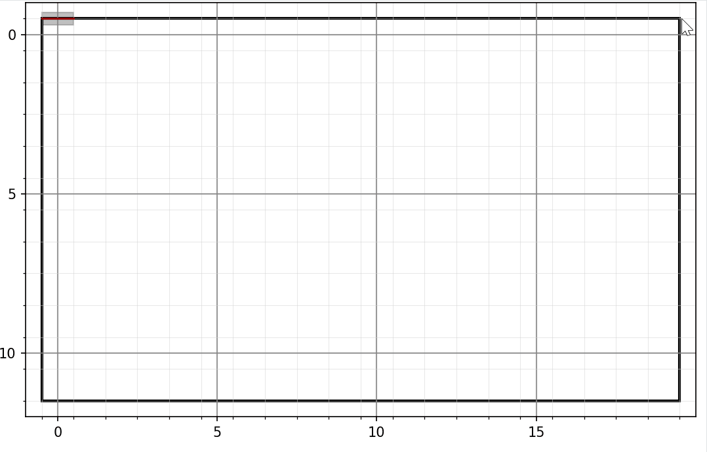 |
| Una planta con solo puertas | 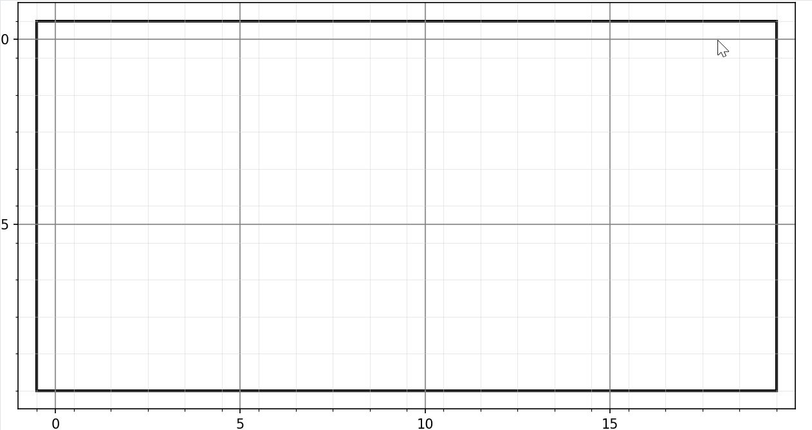 |

### Suite De Simulaciones EvacEngine

Se ha generado una suite documental sobre los modelos disponibles en `models/`. Para cada modelo hay tres escenarios independientes:

```text
doc_walking_suite.json
doc_rolling_suite.json
doc_mixed_suite.json
```
****
Cada simulacion se ha renderizado desde su escenario correspondiente y usa el grafo operativo `multilevel_transfer_to_transfer`.

| Modelo | Walking only | Rolling only | Mixed mobility |
|---|---|---|---|
| `Mi_Planta_SoloPuertas` | 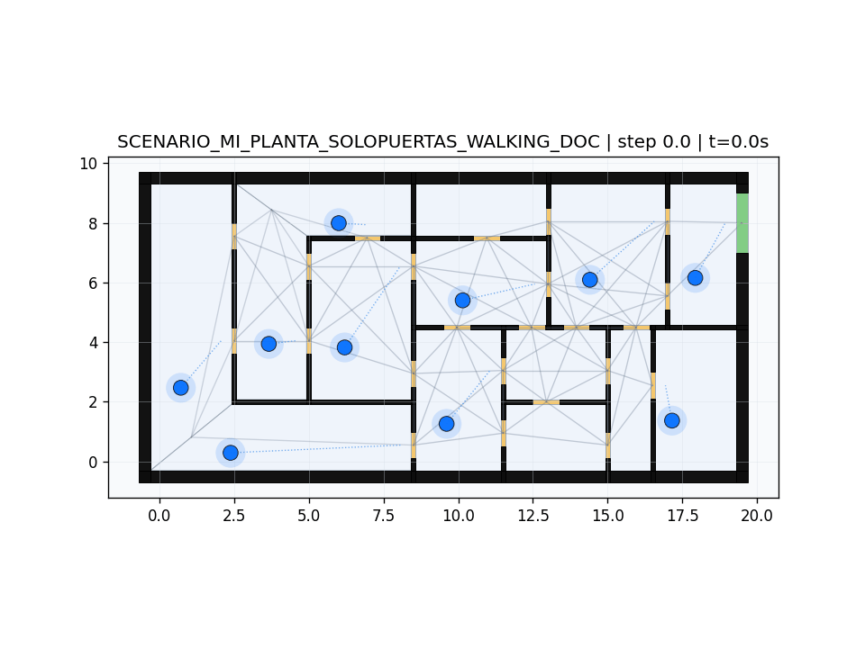 | 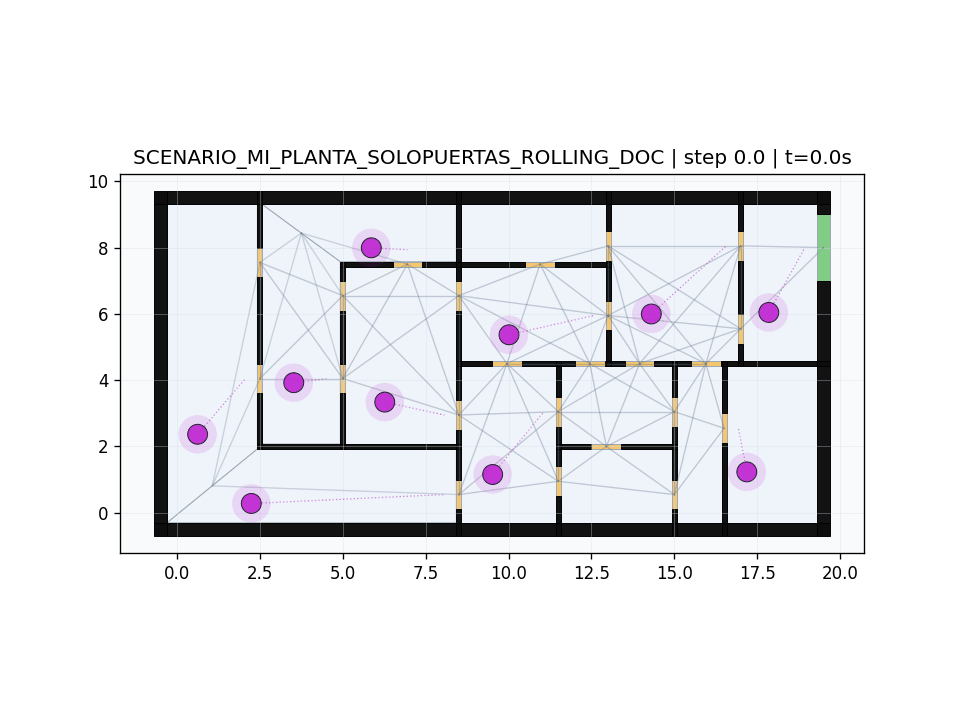 | 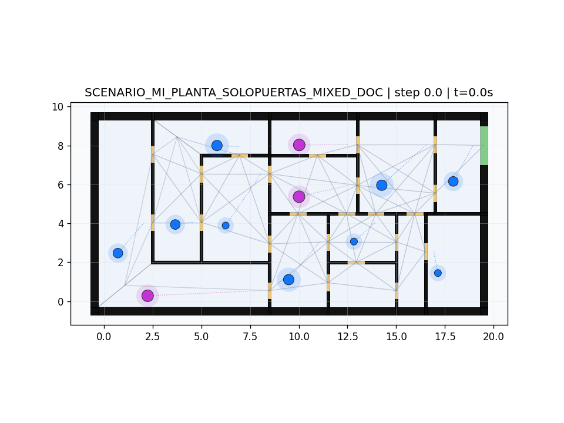 |
| `UnaPlanta_ConConexionesVerticales` | 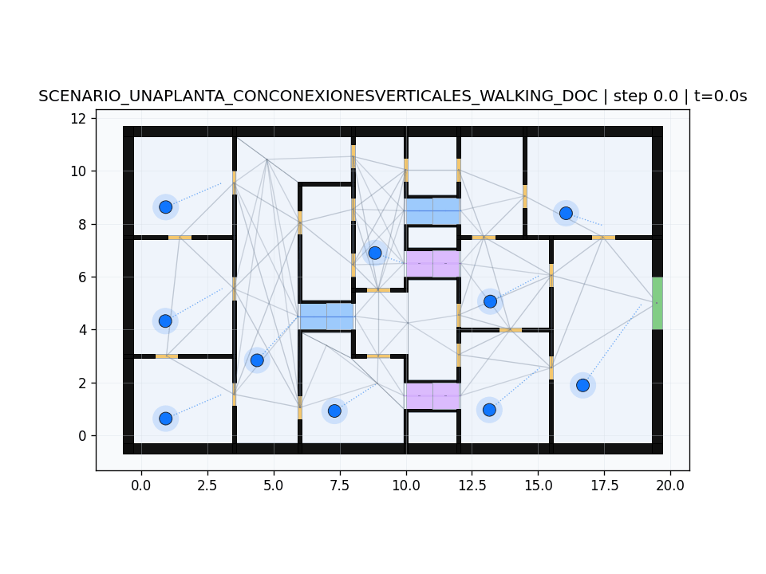 | 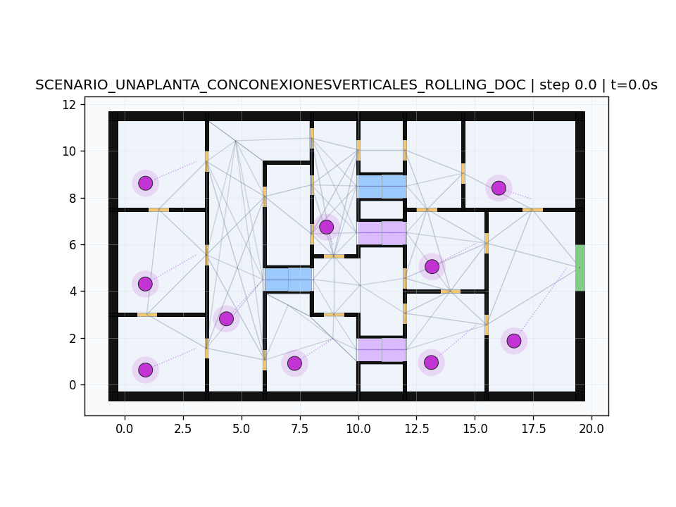 | 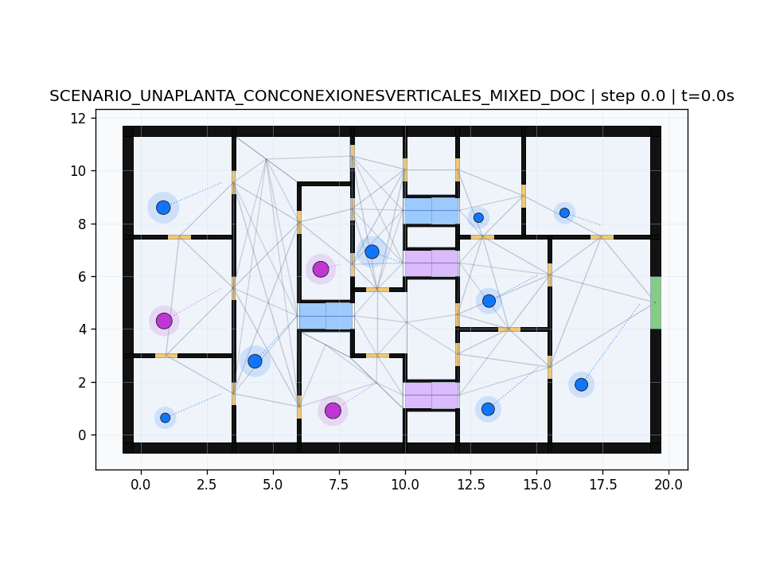 |
| `UnaPlanta_Intento_1` | 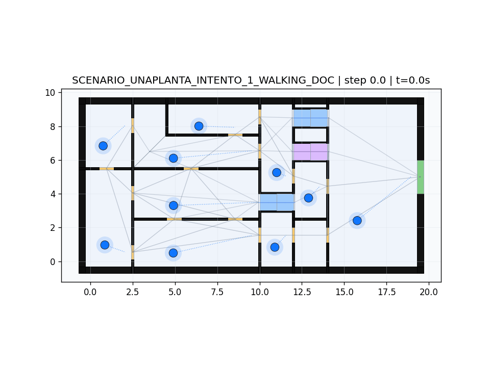 | 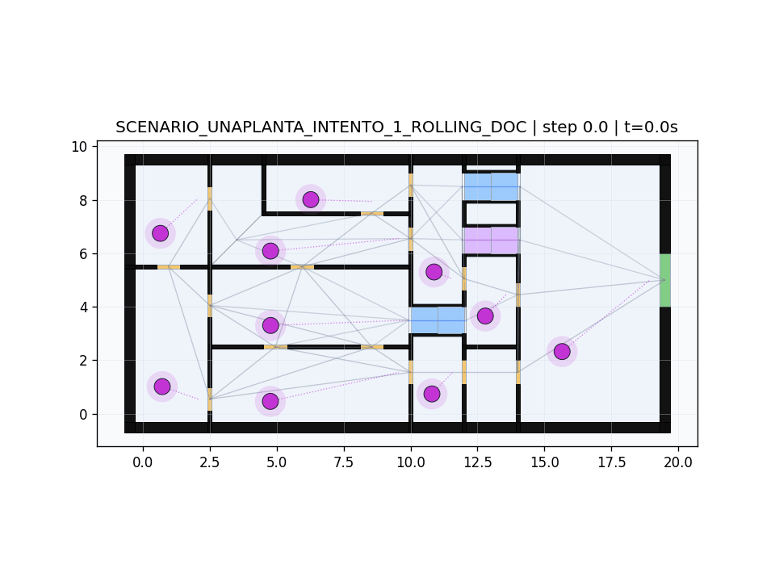 | 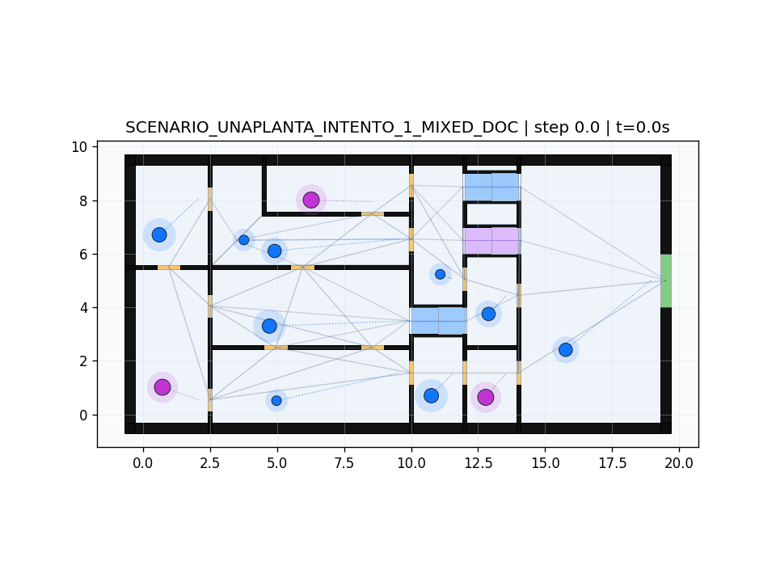 |

Resultado de la tanda documental:

| Modelo | Caso | Agentes evacuados | Tiempo maximo | QA |
|---|---:|---:|---:|---|
| `Mi_Planta_SoloPuertas` | walking | 10/10 | 18.5 s | sin saltos ni solapes |
| `Mi_Planta_SoloPuertas` | rolling | 10/10 | 25.5 s | sin saltos ni solapes |
| `Mi_Planta_SoloPuertas` | mixed | 12/12 | 26.0 s | sin saltos ni solapes |
| `UnaPlanta_ConConexionesVerticales` | walking | 10/10 | 19.5 s | sin saltos ni solapes |
| `UnaPlanta_ConConexionesVerticales` | rolling | 10/10 | 28.5 s | sin saltos ni solapes |
| `UnaPlanta_ConConexionesVerticales` | mixed | 12/12 | 30.5 s | 1 muestra aislada de solape |
| `UnaPlanta_Intento_1` | walking | 10/10 | 18.5 s | sin saltos ni solapes |
| `UnaPlanta_Intento_1` | rolling | 10/10 | 25.0 s | sin saltos ni solapes |
| `UnaPlanta_Intento_1` | mixed | 12/12 | 30.0 s | sin saltos ni solapes |

El detalle reproducible de la suite esta en `docs/tfg/media/simulation/README.md`.

### CER Y Recomendacion De Rutas

La CER explica visualmente la Centralidad de Evacuacion por Reencaminamiento: ruta base, recurso fallado, ruta alternativa, tolerancia y contador acumulado.

| Proceso | Evidencia |
|---|---|
| Centralidad de Evacuacion por Reencaminamiento | 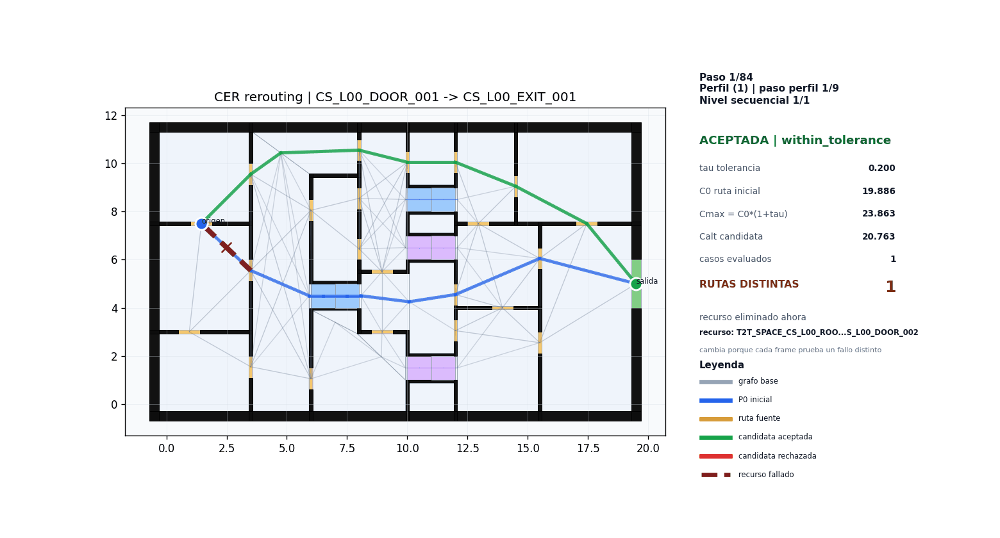 |
| Resumen estatico CER | 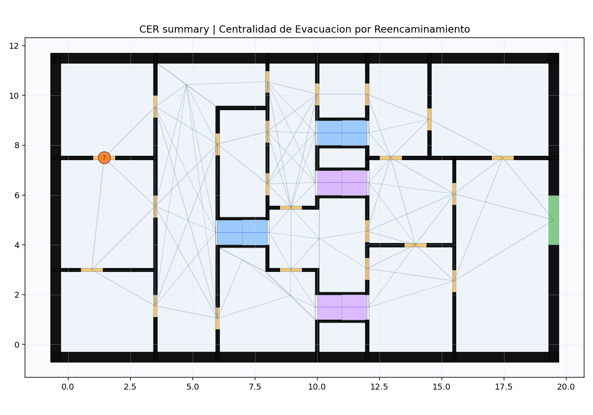 |

## Resumen Ejecutivo

El sistema actual permite:

* Crear modelos indoor por niveles con muros, puertas, ventanas, columnas, rampas, escaleras, ascensores y virtual boundaries.
* Exportar un `indoor_model.json` independiente de la simulacion.
* Crear varios `scenario_model.json` para el mismo modelo, con agentes, beacons, destino, duracion, semilla, perfiles y politica de routing.
* Ejecutar simulaciones multiagente con trayectorias, colisiones, repulsion social, restricciones en puertas y conectores verticales.
* Visualizar y exportar simulaciones como GIF/HTML/JSON.
* Comparar politicas de recomendacion de rutas, no solo algoritmos aislados.
* Calcular y visualizar la CER: Centralidad de Evacuacion por Reencaminamiento.

La contribucion principal no es simplemente aplicar Dijkstra, A*, Floyd-Warshall o Yen. Es construir un marco donde esos algoritmos son herramientas para evaluar politicas de evacuacion basadas en tiempo, seguridad, movilidad, beacons, restricciones fisicas y capacidad de reencaminamiento.

## Valor Del Estado Actual

Antes el proyecto estaba mas cerca de una simulacion estatica o de prototipos separados. Ahora el flujo esta integrado:

* `SpatialEngine` crea el edificio y sus grafos.
* `Indoor Data Model` conserva geometria, semantica y topologia de forma reutilizable.
* `EvacEngine` crea escenarios sobre ese mismo modelo.
* La simulacion tiene agentes con movimiento continuo y diferencias de movilidad.
* El routing usa un grafo operativo de transferencias, no solo una conectividad generica de espacios.
* Las beacons modifican la seguridad durante la simulacion.
* CER permite estudiar capacidad de reencaminamiento ante fallos.
* Los resultados pueden exportarse como GIF, HTML, PNG, JSON y metricas.

Esto permite explicar el TFG como una arquitectura completa: autoria del edificio, modelo indoor, simulacion, recomendacion de rutas y analisis visual.

## Flujo General

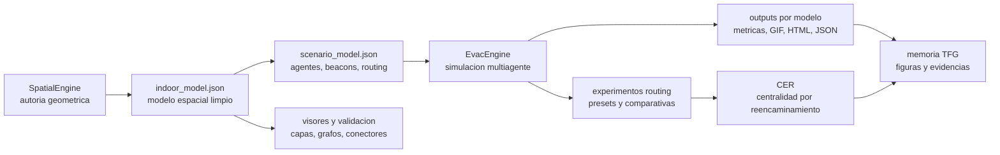
```mermaid
flowchart LR
    A["SpatialEngine<br/>autoria geometrica"] --> B["indoor_model.json<br/>modelo espacial limpio"]
    B --> C["scenario_model.json<br/>agentes, beacons, routing"]
    C --> D["EvacEngine<br/>simulacion multiagente"]
    D --> E["outputs por modelo<br/>metricas, GIF, HTML, JSON"]
    B --> F["visores y validacion<br/>capas, grafos, conectores"]
    D --> G["experimentos routing<br/>presets y comparativas"]
    G --> H["CER<br/>centralidad por reencaminamiento"]
    E --> I["memoria TFG<br/>figuras y evidencias"]
    H --> I
```

## Organizacion Actual

La estructura importante del repositorio es:

```text
models/
  <nombre_modelo>/
    README.md
    spatial/
      indoor_model.json
    evacuation/
      scenarios/
        baseline.json
        <otros_escenarios>.json
    outputs/
      runs/
      cer/
      routing_comparison/

src/
  spatial_engine/
  evac_engine/

schemas/
  indoor/
    indoor_model.schema.json
    scenario_model.schema.json

docs/
  technical/
  tfg/
    memoria/
    figuras/
    media/
      authoring/
      simulation/
      routing/cer/

research/
  prototipos antiguos y experimentos exploratorios
```

Los outputs generados por una simulacion concreta deben quedarse en `models/<modelo>/outputs/`. Los GIFs o videos seleccionados para explicar el trabajo en la memoria deben copiarse a `docs/tfg/media/`.

## Donde Guardar GIFs y Videos para la Memoria

Para grabaciones hechas con ScreenToGif o videos de demostracion manual:

```text
docs/tfg/media/authoring/
  GIFs de dibujar modelos indoor en SpatialEngine.

docs/tfg/media/simulation/
  GIFs seleccionados de simulaciones de EvacEngine.

docs/tfg/media/routing/cer/
  GIFs, PNG o HTML exportados para explicar CER y routing.
```

Los nombres recomendados son descriptivos y estables:

```text
authoring/Dibujado_Space_UnaPlanta_ConConexionesVerticales.gif
authoring/Dibujado_Space_UnaPlanta_ConSoloPuertas.gif
simulation/mi-planta-solopuertas_walking.gif
simulation/mi-planta-solopuertas_rolling.gif
simulation/mi-planta-solopuertas_mixed.gif
simulation/unaplanta-conconexionesverticales_walking.gif
simulation/unaplanta-conconexionesverticales_rolling.gif
simulation/unaplanta-conconexionesverticales_mixed.gif
simulation/unaplanta-intento-1_walking.gif
simulation/unaplanta-intento-1_rolling.gif
simulation/unaplanta-intento-1_mixed.gif
routing/cer/cer_rerouting_explanation.gif
```

No conviene mezclar estos recursos curados con los outputs brutos. Los brutos sirven para reproducir; los de `docs/tfg/media/` sirven para contar el proyecto.

## SpatialEngine

`SpatialEngine` es el motor de autoria del modelo indoor. Su responsabilidad es crear y validar el edificio, no configurar evacuaciones. Exporta un `indoor_model.json` reutilizable.

### Proceso De SpatialEngine

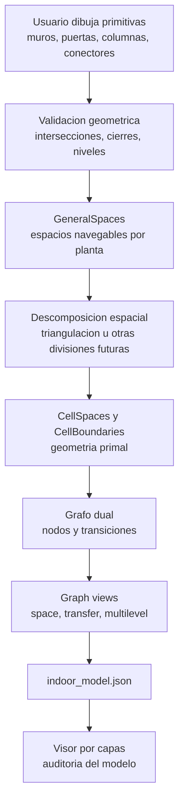
```mermaid
flowchart TD
    A["Usuario dibuja primitivas<br/>muros, puertas, columnas, conectores"] --> B["Validacion geometrica<br/>intersecciones, cierres, niveles"]
    B --> C["GeneralSpaces<br/>espacios navegables por planta"]
    C --> D["Descomposicion espacial<br/>triangulacion u otras divisiones futuras"]
    D --> E["CellSpaces y CellBoundaries<br/>geometria primal"]
    E --> F["Grafo dual<br/>nodos y transiciones"]
    F --> G["Graph views<br/>space, transfer, multilevel"]
    G --> H["indoor_model.json"]
    H --> I["Visor por capas<br/>auditoria del modelo"]
```

### Que Se Comprueba Visualmente

El visor permite revisar:

* geometria dibujada;
* espacios navegables;
* non-navigable spaces;
* puertas, ventanas, columnas y virtual boundaries;
* conectores verticales;
* grafo de conectividad;
* grafo `transfer_to_transfer` y `multilevel_transfer_to_transfer`.

Esta separacion es importante porque el edificio debe poder validarse antes de simularlo.

## Indoor Data Model

El `indoor_model.json` es el nucleo estable del sistema. Representa el edificio y sus relaciones espaciales sin agentes ni eventos de emergencia.

### Relacion Con IndoorGML

El modelo sigue la idea conceptual de IndoorGML:

```text
CellSpace    -> nodo del espacio interior
CellBoundary -> transicion o frontera entre espacios
Dual graph   -> grafo de navegacion derivado del espacio
```

En EvacEngine, los identificadores runtime son los `CellSpace.id`. Por eso, una ruta no se calcula sobre objetos graficos sueltos, sino sobre nodos del modelo indoor.

### Relacion Con IndoorJSON

La estructura se acerca a IndoorJSON porque separa:

* `IndoorFeatures`;
* niveles o capas;
* espacio primal;
* grafo dual;
* propiedades semanticas.

No se declara todavia como conformidad completa con IndoorJSON u OGC IndoorGML. La ventaja practica es que el modelo ya esta ordenado para poder mapearse despues a esos formatos o a una base espacial.

### Estructura Conceptual

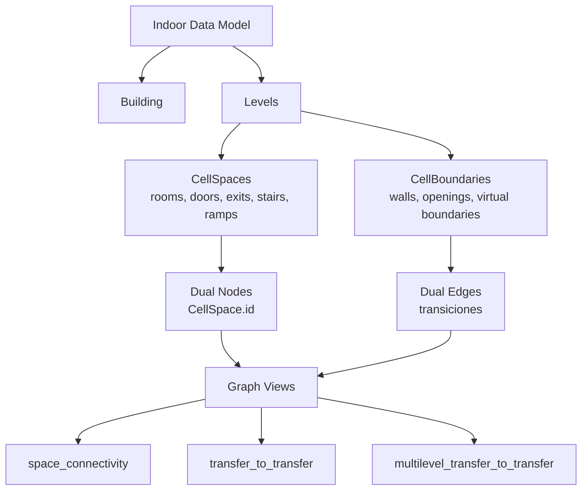
```mermaid
flowchart TD
    A["Indoor Data Model"] --> B["Building"]
    A --> C["Levels"]
    C --> D["CellSpaces<br/>rooms, doors, exits, stairs, ramps"]
    C --> E["CellBoundaries<br/>walls, openings, virtual boundaries"]
    D --> F["Dual Nodes<br/>CellSpace.id"]
    E --> G["Dual Edges<br/>transiciones"]
    F --> H["Graph Views"]
    G --> H
    H --> I["space_connectivity"]
    H --> J["transfer_to_transfer"]
    H --> K["multilevel_transfer_to_transfer"]
```

## Scenario Model

El `scenario_model.json` no redefine el edificio. Describe una situacion de evacuacion sobre un `indoor_model.json`.

Incluye:

* agentes y grupos de poblacion;
* perfiles de movilidad;
* posicion inicial manual o automatica;
* destino o salidas;
* timestep, max steps y seed;
* beacons y curvas de seguridad;
* politica de routing;
* parametros de simulacion.

Esto permite crear varios escenarios sobre el mismo edificio:

```text
mismo indoor_model.json
  -> baseline.json
  -> beacon_blocked_corridor.json
  -> dense_population.json
  -> rolling_users_only.json
```

## EvacEngine

`EvacEngine` carga un modelo indoor y un escenario, construye la topologia de evacuacion y simula agentes en continuo.

### Loop De Simulacion

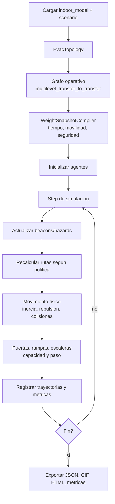
```mermaid
flowchart TD
    A["Cargar indoor_model + scenario"] --> B["EvacTopology"]
    B --> C["Grafo operativo<br/>multilevel_transfer_to_transfer"]
    C --> D["WeightSnapshotCompiler<br/>tiempo, movilidad, seguridad"]
    D --> E["Inicializar agentes"]
    E --> F["Step de simulacion"]
    F --> G["Actualizar beacons/hazards"]
    G --> H["Recalcular rutas segun politica"]
    H --> I["Movimiento fisico<br/>inercia, repulsion, colisiones"]
    I --> J["Puertas, rampas, escaleras<br/>capacidad y paso"]
    J --> K["Registrar trayectorias y metricas"]
    K --> L{"Fin?"}
    L -- "no" --> F
    L -- "si" --> M["Exportar JSON, GIF, HTML, metricas"]
```

### Comportamiento Fisico Actual

El simulador incorpora:

* perfiles de movilidad, como walking, rolling y elder;
* velocidad y aceleracion por perfil;
* repulsion entre agentes;
* evitacion de solapamiento fisico;
* separacion respecto a muros y obstaculos;
* paso controlado por puertas, rampas, escaleras y ascensores;
* trayectorias dibujadas;
* vision y seguimiento de objetivos inmediatos;
* replanificacion periodica.

Este modelo aun no pretende ser una validacion normativa final, pero ya permite observar efectos que una simulacion estatica no podia mostrar: congestiones, bloqueos, cambios de ruta, esperas, colisiones y diferencias por perfil de movilidad.

## Routing Y Politicas De Recomendacion

La base del coste de las aristas es el tiempo, no la distancia geometrica pura. Esto es clave: una escalera o rampa puede parecer corta en 2D, pero tardarse mas por movilidad, pendiente, capacidad o tipo de usuario.

### Grafo Operativo

El routing avanzado usa:

```text
multilevel_transfer_to_transfer
```

Este grafo representa el backbone de evacuacion: puertas, salidas, virtual boundaries y conectores verticales. El agente parte de su coordenada exacta y se conecta a los transfers relevantes de su espacio; desde ahi se calcula la ruta.

### Coste

La formulacion general preparada para el TFG es:

```text
Coste(e) = alpha * t(e) + beta * r(e) + otros terminos futuros
```

Donde:

* `t(e)` es tiempo de cruce o desplazamiento.
* `r(e)` es riesgo o penalizacion de seguridad normalizada.
* `alpha` controla la importancia del tiempo.
* `beta` controla la importancia de seguridad/riesgo.

En la practica actual, el tiempo es la base estable. La seguridad de beacons y bloqueos dinamicos entra en el snapshot ponderado del grafo.

### Algoritmos Frente A Politicas

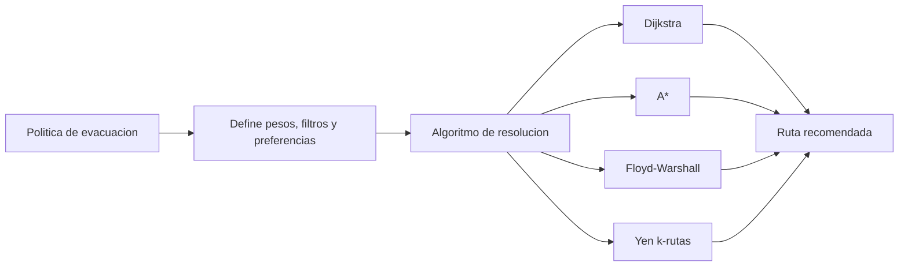
```mermaid
flowchart LR
    A["Politica de evacuacion"] --> B["Define pesos, filtros y preferencias"]
    B --> C["Algoritmo de resolucion"]
    C --> D["Dijkstra"]
    C --> E["A*"]
    C --> F["Floyd-Warshall"]
    C --> G["Yen k-rutas"]
    D --> H["Ruta recomendada"]
    E --> H
    F --> H
    G --> H
```

Comparar algoritmos tiene sentido computacional. Comparar politicas tiene sentido de investigacion de evacuacion: tiempo minimo, seguridad, robustez, agilidad, tolerancia al fallo y reencaminamiento.

## Beacons Y Seguridad Dinamica

Las beacons permiten simular lectura temporal de seguridad en una zona. En la UI se pueden colocar sobre el modelo, definir una curva temporal y observar como el valor afecta al snapshot de pesos.

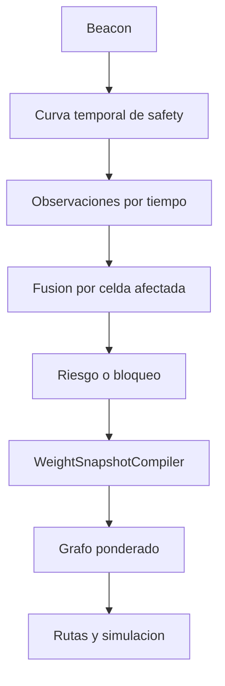
```mermaid
flowchart TD
    A["Beacon"] --> B["Curva temporal de safety"]
    B --> C["Observaciones por tiempo"]
    C --> D["Fusion por celda afectada"]
    D --> E["Riesgo o bloqueo"]
    E --> F["WeightSnapshotCompiler"]
    F --> G["Grafo ponderado"]
    G --> H["Rutas y simulacion"]
```

La decision de usar `safety` en la interfaz facilita la interpretacion: `1` significa seguro y `0` significa no seguro. Internamente puede transformarse a riesgo/penalizacion para que el algoritmo minimice coste.

## CER: Centralidad De Evacuacion Por Reencaminamiento

La CER mide la capacidad de un nodo para conservar alternativas de evacuacion cuando fallan recursos de una ruta. No sustituye al camino minimo; lo complementa.

Para un origen `v` y una salida `d`:

```text
P0(v,d) = ruta minima inicial
C0(v,d) = coste de P0
Cmax(v,d) = (1 + tau) * C0
```

Una ruta alternativa cuenta si:

```text
coste(P_alt) <= Cmax
```

La unidad de fallo preferida es `resource`: si falla una puerta, rampa o conector, falla el recurso fisico completo, no solo un arco dirigido.

### Calculo CER

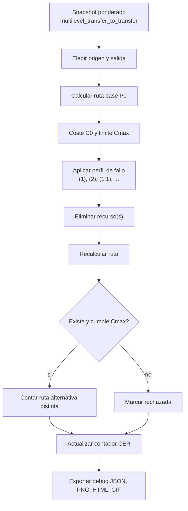
```mermaid
flowchart TD
    A["Snapshot ponderado<br/>multilevel_transfer_to_transfer"] --> B["Elegir origen y salida"]
    B --> C["Calcular ruta base P0"]
    C --> D["Coste C0 y limite Cmax"]
    D --> E["Aplicar perfil de fallo<br/>(1), (2), (1,1), ..."]
    E --> F["Eliminar recurso(s)"]
    F --> G["Recalcular ruta"]
    G --> H{"Existe y cumple Cmax?"}
    H -- "si" --> I["Contar ruta alternativa distinta"]
    H -- "no" --> J["Marcar rechazada"]
    I --> K["Actualizar contador CER"]
    J --> K
    K --> L["Exportar debug JSON, PNG, HTML, GIF"]
```

La visualizacion CER muestra el grafo base, la ruta inicial, el recurso fallado, la ruta alternativa, si fue aceptada o rechazada y el contador acumulado. Sirve para auditar el razonamiento, no solo para generar una animacion bonita.

## Preparacion Para SQL Y Bases De Datos

El modelo esta preparado para un mapeo relacional o espacial porque usa entidades separadas e identificadores estables.

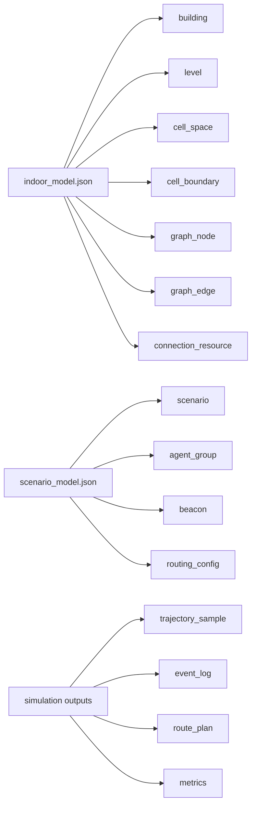
```mermaid
flowchart LR
    A["indoor_model.json"] --> B["building"]
    A --> C["level"]
    A --> D["cell_space"]
    A --> E["cell_boundary"]
    A --> F["graph_node"]
    A --> G["graph_edge"]
    A --> H["connection_resource"]
    I["scenario_model.json"] --> J["scenario"]
    I --> K["agent_group"]
    I --> L["beacon"]
    I --> M["routing_config"]
    N["simulation outputs"] --> O["trajectory_sample"]
    N --> P["event_log"]
    N --> Q["route_plan"]
    N --> R["metrics"]
```

Una evolucion natural seria almacenar geometria como PostGIS, graph views como vistas materializadas y escenarios como overlays sobre el modelo indoor.

## Comandos Utiles

Interfaz rapida:

```powershell
python tools\quick_start.py
```

Abrir EvacEngine con un modelo:

```powershell
python -m src.evac_engine workbench --model UnaPlanta_ConConexionesVerticales --port 8765
```

Ejecutar simulacion y guardar GIF/HTML:

```powershell
python -m src.evac_engine run --scenario models\UnaPlanta_ConConexionesVerticales\evacuation\scenarios\baseline.json --output-dir models\UnaPlanta_ConConexionesVerticales\outputs\runs\baseline --gif models\UnaPlanta_ConConexionesVerticales\outputs\runs\baseline\simulation.gif --html models\UnaPlanta_ConConexionesVerticales\outputs\runs\baseline\simulation.html --level LEVEL_00
```

Comparar presets de routing:

```powershell
python -m src.evac_engine compare-routing --scenario models\UnaPlanta_ConConexionesVerticales\evacuation\scenarios\baseline.json --output-dir models\UnaPlanta_ConConexionesVerticales\outputs\routing_comparison
```

Exportar visualizacion CER:

```powershell
python -m src.evac_engine cer --scenario models\UnaPlanta_ConConexionesVerticales\evacuation\scenarios\baseline.json --origin CS_L00_DOOR_001 --target CS_L00_EXIT_001 --profile MP_WALKING --formats json,png,html --gif --level LEVEL_00
```

Cuando no se indica `--output-dir`, la CER se guarda dentro del modelo:

```text
models\<modelo>\outputs\cer\<scenario>__<origin>__<target>\
```

## Interfaces Locales Y Puertos

Las interfaces web del proyecto son locales. Cuando se ejecuta un workbench, Python levanta un servidor HTTP en `127.0.0.1:<puerto>`.

Ejemplo:

```text
http://127.0.0.1:8765/
```

El puerto solo identifica donde escucha esa sesion local. Si el navegador muestra `ERR_CONNECTION_REFUSED`, significa que el servidor no esta arrancado o que se abrio una URL antigua de una sesion ya cerrada.

## Decisiones De Diseño

* `indoor_model.json` y `scenario_model.json` estan separados para poder reutilizar un edificio en muchos experimentos.
* Los modelos de trabajo viven en `models/<modelo>/`, no dispersos por carpetas antiguas.
* Los outputs de simulacion se guardan dentro del modelo que los produjo.
* El grafo operativo de evacuacion es `multilevel_transfer_to_transfer`.
* El coste base es tiempo, no distancia.
* Los algoritmos se interpretan como herramientas de politicas de recomendacion.
* CER se calcula sobre el grafo operativo o sobre snapshots ponderados, y se visualiza con pasos auditables.
* La interfaz debe servir para configurar y verificar; la CLI debe servir para reproducir y generar tablas.

## Estado Actual Y Trabajo En Curso

Ya existe un flujo funcional de autoria, modelo, escenario, simulacion, visualizacion y CER. El trabajo actual se centra en:

* terminar de calibrar fisica de agentes;
* mejorar politicas de recomendacion de rutas;
* documentar comparativas de routing;
* trasladar resultados a la memoria;
* consolidar graficos, GIFs y outputs explicativos.

El objetivo final es que el lector pueda abrir el repositorio y entender rapidamente tres capas:

1. Como se crea el modelo indoor.
2. Como se configura y simula una evacuacion.
3. Como se estudian politicas de recomendacion de rutas sobre ese modelo.


| Feedback | Respuesta actual |
|---|---|
| Validación empírica | Se están consolidando suites de simulación, métricas, tiempos, QA visual y comparativas de routing. |
| Función de coste | El README distingue coste base temporal, seguridad/riesgo y políticas de recomendación. |
| Dijkstra, A*, Floyd-Warshall y Yen | Se reformulan como herramientas de cálculo, no como la contribución principal. |
| Figuras y evidencias | Se han preparado GIFs, PNGs, HTML y diagramas Mermaid para trasladar después a la memoria. |
| IndoorGML/PostGIS | Se conserva como base conceptual y posible proyección SQL/PostGIS, pero el runtime actual usa JSON. |
| Redacción de la memoria | El Word está siendo reestructurado para reflejar el sistema actual. |

## Documentacion Relacionada

* `docs/technical/architecture/indoor_data_model_architecture.md`
* `docs/technical/architecture/evacengine_implementation_notes.md`
* `docs/technical/research/evacengine_routing_experiment_framework.md`
* `docs/tfg/memoria/`
* `docs/tfg/media/README.md`
