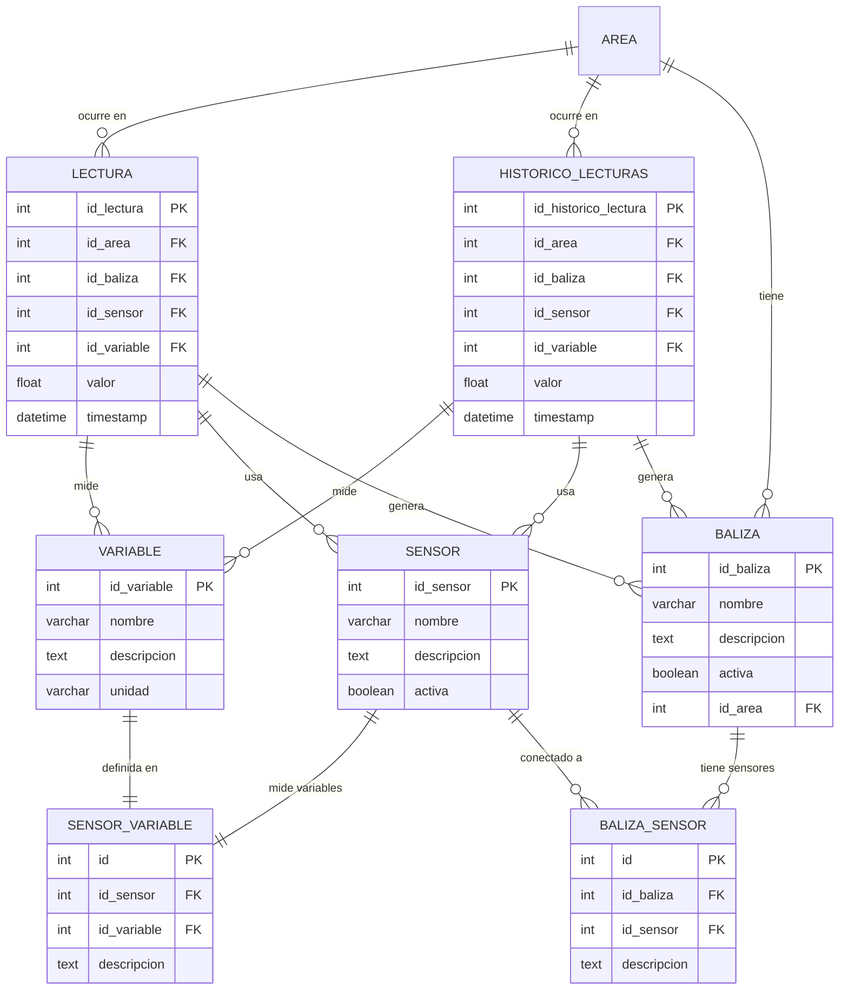
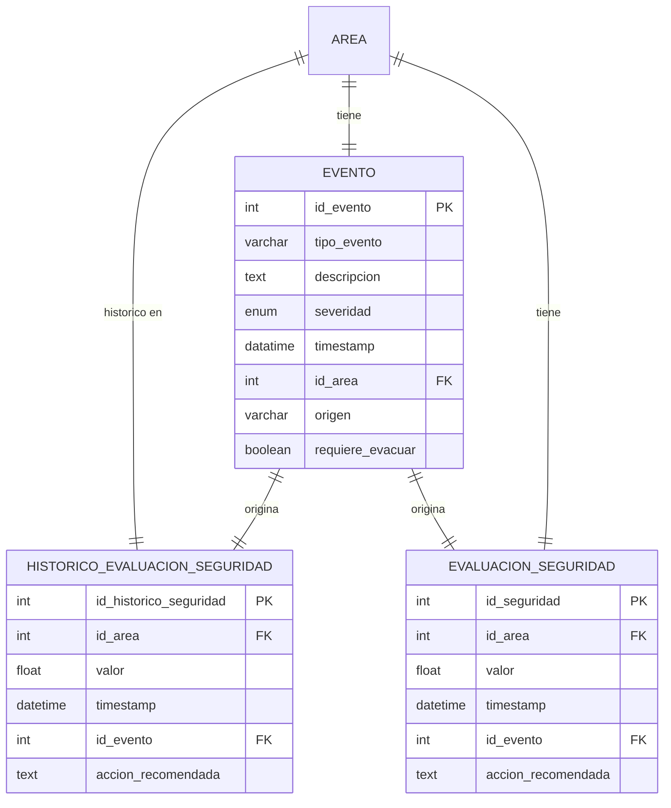
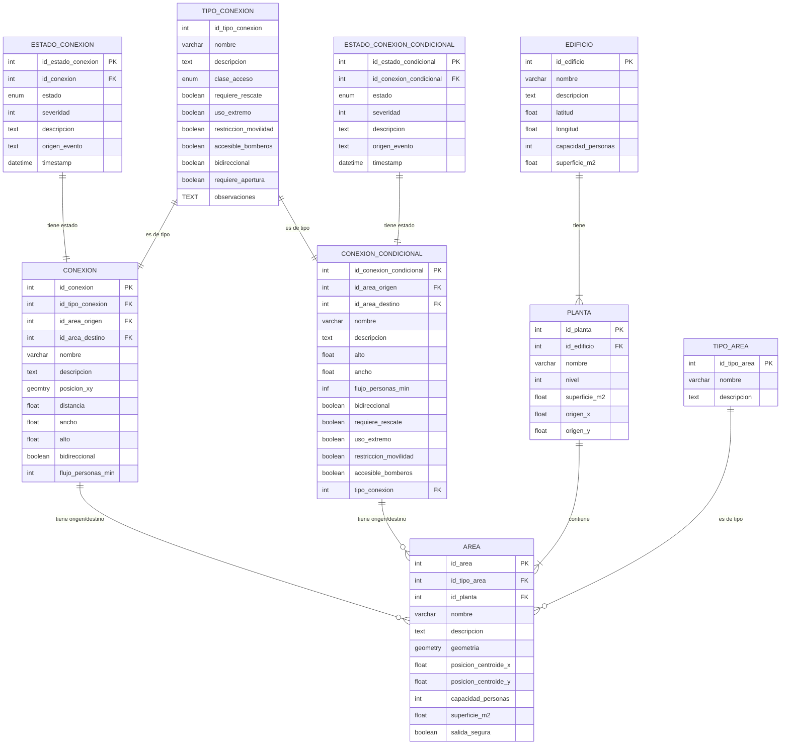

Vale, ahora quiero replantear algunas cosas. Aquí quiero que estudies bien el tema de IndoorFeatures, Thematic Layer, Interlayer_Connections, PrimalSpaceLayer y DualSpaceLayer, además de lo demás que ya hemos trabajado.

Quiero desarrollar una idea y ver de qué formas diferentes puedo llevarla a cabo.

- Quiero crear una base de datos que contenga los datos geométricos en 2D de una planta de un edificio. Esto significa que incluya los datos topográficos: la ubicación de cada sala respecto a un punto de referencia, la posición de cada puerta, qué salas están conectadas con qué puertas o ventanas, y la distancia entre los nodos del DualSpaceLayer, que sería un weight, por ejemplo.

El objetivo es tener una base en la que pueda insertar, en algún formato, la geometría de la planta del edificio conformada por espacios y puertas en contacto que representen los espacios navegables. No tengo muy en cuenta los espacios no navegables, como las paredes (aunque podría considerarlos, pero quizá se vuelva más complejo). Con esa geometría, y gracias al DualSpace compuesto por Nodes y Edges, podría extraer fácilmente el grafo para exportarlo a NetworkX, ya sea mediante una consulta de los nodos, sus conexiones y posiciones para dibujarlo en NetworkX, o de alguna otra forma. Esto sería la base para una serie de operaciones posteriores.

- Además de guardar los datos espaciales, como ya habría hecho, necesito almacenar en esta misma base de datos (o en otra distinta, pero necesariamente relacionada) los datos de las lecturas de unas determinadas balizas en cada una de las salas. Esta información afecta a la sala, pero me interesa tener estas medidas asociadas al nodo que corresponde a esa sala. Esta es la parte que más me preocupa.

Por un lado, me he planteado crear otra base de datos, pero necesito que cada baliza (con sus respectivas lecturas y valores) esté referenciada a una sala específica, ya que las balizas se encuentran físicamente en las salas. Para ello, quiero aprovechar los IDs de PostgreSQL, es decir, construir esto dentro de la base de datos como otro bloque —el bloque de lecturas— que asocie cada baliza a una sala concreta y que permita consultas sencillas. Por ejemplo, poder consultar constantemente qué temperatura hay en cada sala, con la idea de que en el futuro se pueda representar en pantalla con un número en tiempo real (streaming) y, además, tener un gráfico que muestre los valores históricos.

Yo he modelado esto en Mermaid de la siguiente forma:

Ahi puedes ver que la tabla **lectura** prentende solo contener la ultima de las lecturas y que **Historico lecturas** pretende contener esa última lectura y las anteriores (Con sus respectiva particiones) y la tabla **AREA** es a la sala a la que ahce referencia cada lectura, aqui podria ser *General_space* creo que seria lo más indicado.

Bien pero aqui no es de donde queiro sacar el estado de cada una de las salas, esto lo he modelado yo como otro bloque diferente, para evaluar la seguridad de las salas en base a las lecturas:

Este bloque simula un CEP (Complex Event Processing), pero de forma simple. Quiero mantener la simplicidad en el número de variables que se miden en las lecturas, para que las operaciones no se vuelvan demasiado complejas.

Aquí tengo dos opciones:

- Procesamiento interno: realizar las operaciones de forma automática a medida que lleguen nuevas lecturas al bloque de sensores.

- Procesamiento externo (creo que es la mejor opción, corrígeme si no es así): extraer las lecturas mediante consultas a Python, operar con ellas para determinar el valor de seguridad de cada sala, e insertar el resultado en la tabla de evaluación de seguridad, rellenando también el campo de evento correspondiente.

En este segundo enfoque, por un lado insertaría los resultados en la base de datos y, por otro, construiría una matriz de seguridad con esos resultados. En dicha matriz, las aristas que conecten con nodos de menor seguridad se eliminarían o se les asignaría un peso mucho mayor, de forma que no se tengan en cuenta en el cálculo de rutas.

Además, me gustaría tener una tabla para guardar la ruta recomendada actual y un histórico de rutas. Esto lo podemos abordar más adelante. En cuanto al funcionamiento de las tablas streaming, como LECTURA y EVALUACIÓN_SEGURIDAD, junto con sus respectivos históricos, es algo que también podemos tratar más adelante. Si necesitas más detalles, puedo explicártelos.

Si ayuda saber como habia modelado yo las conexiones y demas cosas fue asi:

Pero como ya te imaginas, yo quieri seguir el modelo IndoorGML con todo lo aprendido hasta ahora, por lo que voy a hace muchos cambios a esta parte o incluso adoptar extamente el modeo que ya hemos hecho para alinearme con este estandar.

Porfavor toma tu tiempo de entender y procesar todo y dame una respuesta muy completa y detallada. dame tus opiniones, tus sugerencias y justificame todo para ayudarme a documentar todo el proceso.