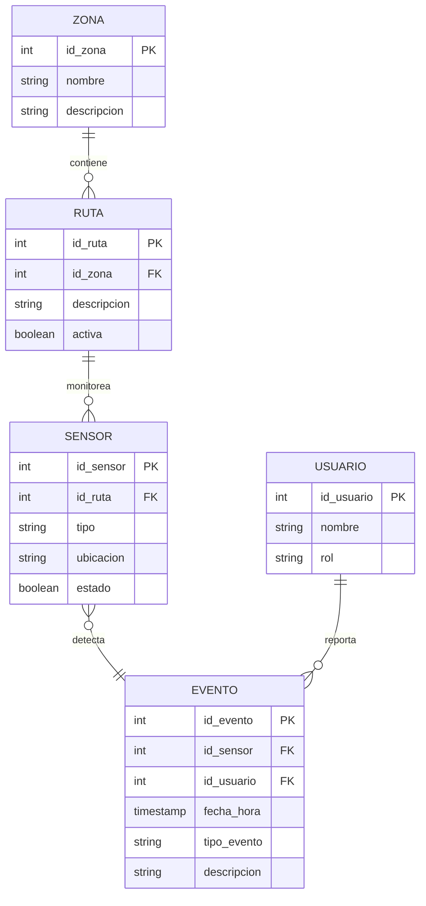

# Base de Datos para Rutas Dinámicas de Evacuación en Interiores

## Diseño y Creación de la Base de Datos

### Modelo Entidad-Relación (ER)

A continuación se presenta el diagrama ER utilizando [Mermaid](https://mermaid-js.github.io/mermaid/#/):



### Script de Creación de la Base de Datos (PostgreSQL)

```sql
CREATE TABLE zona (
    id_zona SERIAL PRIMARY KEY,
    nombre VARCHAR(100) NOT NULL,
    descripcion TEXT
);

CREATE TABLE ruta (
    id_ruta SERIAL PRIMARY KEY,
    id_zona INTEGER REFERENCES zona(id_zona),
    descripcion TEXT,
    activa BOOLEAN DEFAULT TRUE
);

CREATE TABLE sensor (
    id_sensor SERIAL PRIMARY KEY,
    id_ruta INTEGER REFERENCES ruta(id_ruta),
    tipo VARCHAR(50),
    ubicacion VARCHAR(100),
    estado BOOLEAN DEFAULT TRUE
);

CREATE TABLE usuario (
    id_usuario SERIAL PRIMARY KEY,
    nombre VARCHAR(100),
    rol VARCHAR(50)
);

CREATE TABLE evento (
    id_evento SERIAL PRIMARY KEY,
    id_sensor INTEGER REFERENCES sensor(id_sensor),
    id_usuario INTEGER REFERENCES usuario(id_usuario),
    fecha_hora TIMESTAMP DEFAULT CURRENT_TIMESTAMP,
    tipo_evento VARCHAR(50),
    descripcion TEXT
);
```

### Integración con Sensores e IoT

- Se recomienda utilizar APIs RESTful o MQTT para la comunicación entre sensores y la base de datos.
- Ejemplo de endpoint para registrar eventos desde sensores:

```http
POST /api/eventos
Content-Type: application/json

{
  "id_sensor": 1,
  "id_usuario": 2,
  "tipo_evento": "humo",
  "descripcion": "Detección de humo en pasillo A"
}
```

- Los scripts de backend pueden estar desarrollados en Python (Flask, FastAPI) o Node.js, conectando con PostgreSQL y gestionando la actualización de rutas en tiempo real.

### Simulación y Pruebas

- Se pueden crear scripts para simular eventos y cambios en el estado de sensores, permitiendo validar la actualización dinámica de rutas.
- Ejemplo de script en Python para insertar eventos de prueba:

```python
import psycopg2
from datetime import datetime

conn = psycopg2.connect("dbname=evacuacion user=postgres password=tu_clave")
cur = conn.cursor()

cur.execute("""
    INSERT INTO evento (id_sensor, id_usuario, tipo_evento, descripcion, fecha_hora)
    VALUES (%s, %s, %s, %s, %s)
""", (1, 2, 'humo', 'Simulación de humo en zona 1', datetime.now()))

conn.commit()
cur.close()
conn.close()
```

---

Estos elementos permiten visualizar, crear y probar la base de datos para rutas dinámicas de evacuación, facilitando la integración con sensores y la simulación de escenarios de emergencia.
