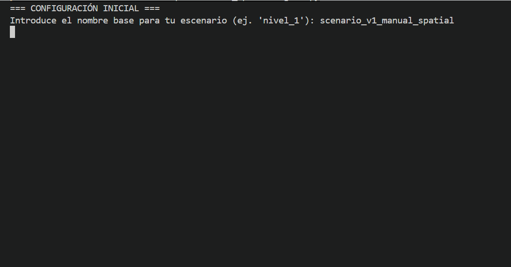

# Baseline MLSM v1

## Animaciones de referencia

### Escenario existente

### Escenario generado manualmente desde SpatialEngine

## Archivos baseline

| Archivo | Descripción |
|---|---|
| [`scenario_v0_existing.json`](scenario_v0_existing.json) | Escenario existente usado como referencia previa. |
| [`scenario_v1_manual_spatial_FINAL.json`](scenario_v1_manual_spatial_FINAL.json) | Escenario generado manualmente desde `MLSM_SpatialEngine.py`. |
| [`metrics_v0_existing.csv`](metrics_v0_existing.csv) | Métricas de la simulación existente. |
| [`metrics_v1_existing.csv`](metrics_v1_existing.csv) | Métricas de la simulación del escenario manual. |
| [`Animation_v0_evacuation.gif`](Animation_v0_evacuation.gif) | GIF de referencia de la evacuación existente. |
| [`Animation_v1_scenario.gif`](Animation_v1_scenario.gif) | GIF del escenario manual. |

## Objetivo

Congelar el estado funcional actual del flujo:

SpatialEngine → JSON MLSM v1 → EvacEngine → métricas CSV / GIF

Esta carpeta sirve como referencia antes de introducir JSON v2, balizas, niveles/Z, PostGIS o refactors.

## Rama

`docs/baseline-current-state`

## Archivos incluidos

| Archivo | Descripción |
|---|---|
| `scenario_v0_existing.json` | Escenario existente usado como referencia previa. |
| `scenario_v1_manual_spatial_FINAL.json` | Escenario generado manualmente desde `MLSM_SpatialEngine.py`. |
| `metrics_v0_existing.csv` | Métricas obtenidas con el escenario existente. |
| `metrics_v1_existing.csv` | Métricas obtenidas tras nueva ejecución del flujo actual. |
| `Animation_v0_evacuation.gif` | Animación de referencia de la simulación existente. |
| `Animation_v1_scenario.gif` | Animación generada para el escenario/manual actual. |

## Flujo probado

1. Ejecutar `MLSM_SpatialEngine.py`.
2. Crear o cargar un escenario.
3. Exportar JSON MLSM v1.
4. Ejecutar `MLSM_EvacEngine.py`.
5. Confirmar que se genera CSV de métricas.
6. Guardar GIF si se genera.

## Observaciones

- `MLSM_EvacEngine.py` todavía usa una ruta de escenario hardcodeada.
- `MLSM_SpatialEngine.py` genera nombres con sufijo `_FINAL` o timestamp.
- El flujo depende todavía de interacción con Matplotlib.
- Esta fase no modifica la lógica de `SpatialEngine` ni de `EvacEngine`.

## Estado

- SpatialEngine ejecutado correctamente: sí
- EvacEngine ejecutado correctamente: sí
- CSV generado correctamente: sí
- GIF generado correctamente: sí