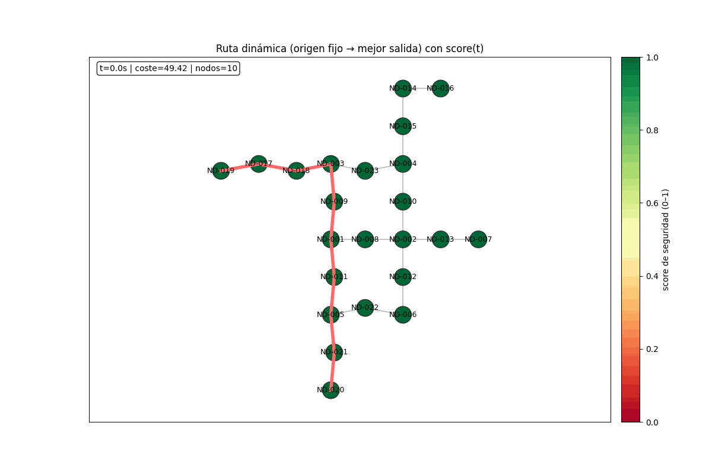
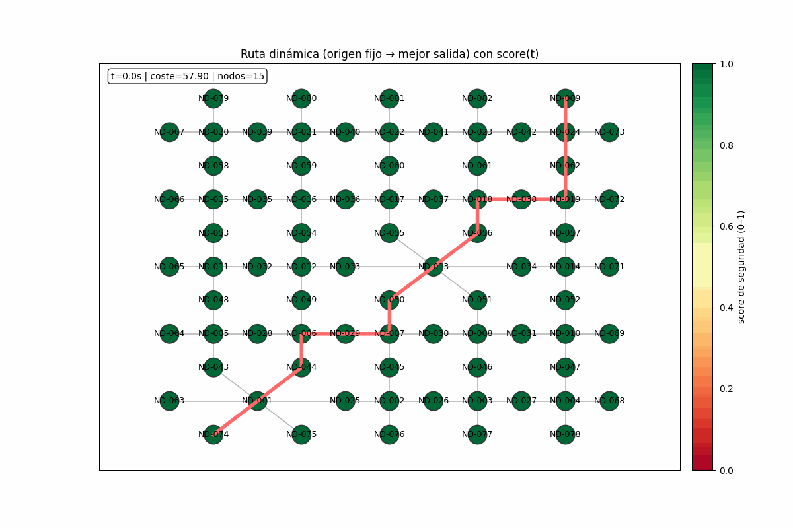

Codigos para simular un score dinamico de seguridad
Visual del resulado con un algitmo generico de ruta minima

LO SIGUIENTE:

APLICARMELMCALCULO DE LA CENTRALIDAD DE EVACUACION: que se calcule con cada cmbio de grafo
CALCULO DE AGILIDAD (PAPER) Y COMPARAR QUE ALGORITMO (O UNO CUSTOM) ES EL QUE MAYOR AGILIDAD SUMA EN UN ENTORNO VARIABLE 